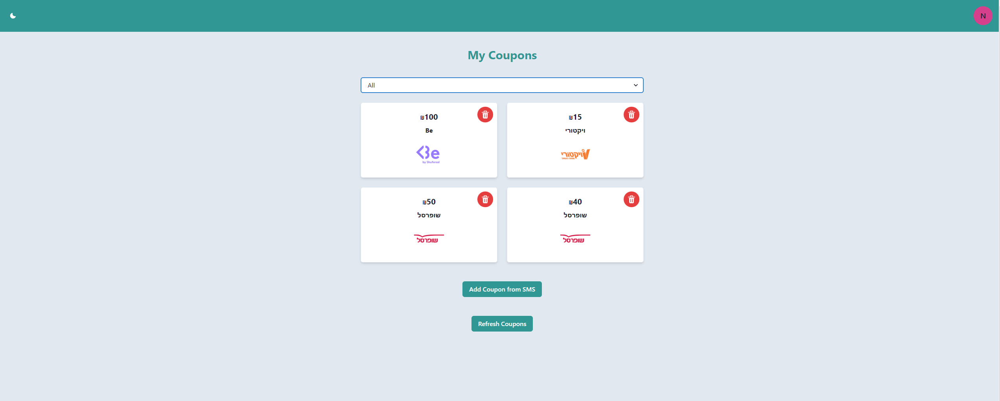
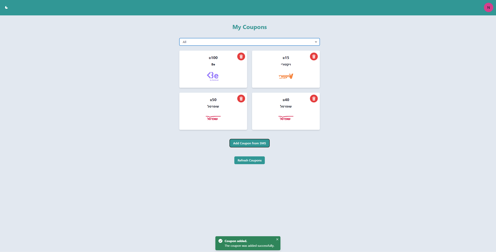
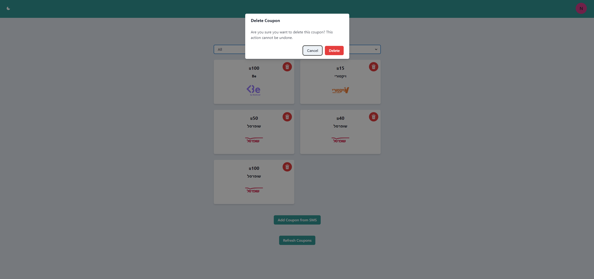
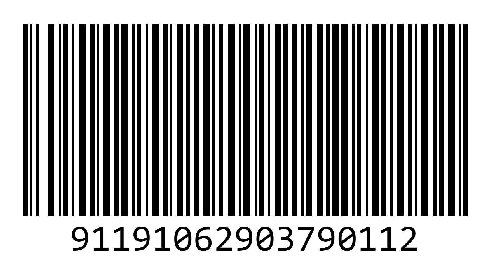

# Cibus Coupons

This project is a coupon management system built with React (Vite) and Chakra UI. It allows users to view, filter, and manage their coupons. Coupons can also be added automatically from SMS messages, and each coupon includes details like the discount amount, link, and the place where it can be accepted.

## Features

- Display a list of coupons.
- Show coupon's barcode.
- Filter coupons by accepted places.
- Add coupons from SMS.
- Responsive design using Chakra UI.

## Screenshots

Here are a few screenshots of the project:

### Home Page

### Login Page

### Coupons Page

### Add Coupons

### Delete Coupons

### Coupon Barcode

## Technologies Used

- React (Vite)
- Chakra UI
- Node.js (Backend)
- Express
- MongoDB (Database)

